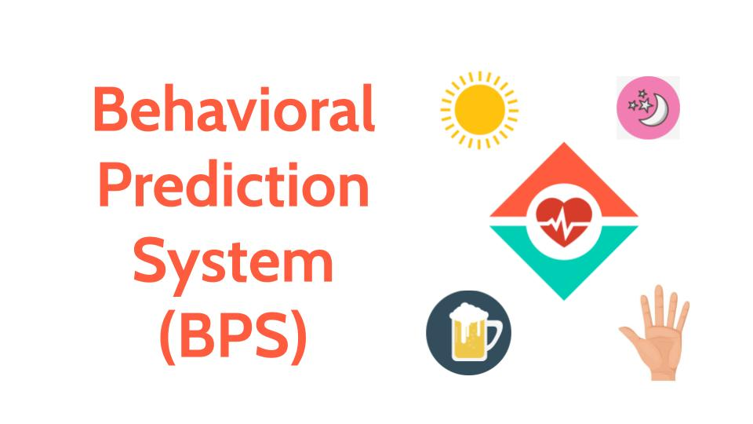

## Behavioral Prediction System for the 3rd PNP ITMS Hackathon

Website: https://superphysics.org/bps/
Google Colab: https://colab.research.google.com/drive/1tqQXIosRe6raZaHaFjAVyP8K0BeFPCE-?usp=sharing

> start time: 9am Oct 18, 2022

1. Import hands dataset from Kaggle and get only right hand palms  https://www.kaggle.com/datasets/shyambhu/hands-and-palm-images-dataset/code?resource=download

2. Create Python Script

- import modules
- data
  - upload data to collab  
  - assign to var
- dataset
  - create dataset params
  - split dataset to training 80% (train_ds) and validation 20% (val_ds)
  - find or set class names
  - pass the dataset to the Keras Model.fit method for training 
  - config dataset for performance
  - standardize the data in the dataset by normalizing
- model
  - create and compile the model
  - get summary
- train
- visualize results
- test on samples

> end time: 12 midnight Oct 19, 2022 (15 hours)

## Problem: Limited samples causes overfitting

## Solutions:

1. Data augmentation takes the approach of generating additional training data from your existing examples

Notes: 

Keras Sequential has 3 convolution blocks as tf.keras.layers.Conv2D. It has:
- a max pooling layer  as tf.keras.layers.MaxPooling2D in each of them
- a fully-connected layer as tf.keras.layers.Dense
  - It has 128 units on top of it that is activated by a ReLU

